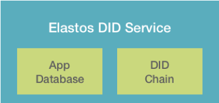

# Elastos DID Service（draft）

* DATA MODEL AND SYNTAXES FOR DID
* 作者 SONG SJUN

## 目录

* 概述
* ELASTOS DID SERVICE 接口
    * DID管理
        * 创建DID
        * 向DID充值【收费】
        * 从DID提现【收费】
        * 注销DID【收费】
        * 签名
        * 验签
        * 获取DID公钥
        * 写入属性【收费】
        * 读取属性
    * 身份管理
        * 用户帐号绑定DID【收费】
        * 生成验证身份请求
        * 应答验证身份请求
        * 应答身份验证同时请求验证对方身份
        * 第三方登录
    * 数据管理
        * 数据存证【收费】
        * 读取存证
        * 为属性增加证明【收费】

## 概述

Elastos DID Service是面向DApp开发者的一个软件服务包，其代码完全按照《Elastos DID Programming Guide》中的建议来实现。

Elastos DID Side-Chain在区块链共识层面提供了基础操作方法，而DID Service将在这些基础方法之上，结合具体业务场景，将常用操作进行封装和实现，从而为DApp开发者提供更简单、更方便和使用的接口方法。

Elastos DID Service以两种方式提供：

* 二进制软件包和源代码，目前版本是java语言实现的jar包；
* 公共服务器接口，由Elastos基金会提供和运营的服务器运行的DID Service，全网可以直接访问。

Elastos DID Service定位于DID Side-Chain与应用之间的中间层，结合应用常见的业务场景，结合DID编程规范，封装高级功能。

在DID Side-Chain基础接口的之上，增加传统数据库作为数据存储，DID Side-Chain用于保存业务数据的摘要存证。从应用的角度，DID是一个完整、独立的基础服务。

DID Service目标是在不改变传统、现有的应用业务逻辑，将存证、确权、证明、第三方登录、访问授权等等一些列操作和实现都放在DID Service内实现。对现有应用改造成本最低。

当多个应用的用户身份、业务数据存证上链以后，可以通过DID互联互通、组合出新的业务模式。

DID Service提供的功能包括：DID管理、绑定身份、身份验证、数据存证、据授权、证明、第三方登录等等。

## Elastos DID Service 接口

### DID管理

#### 创建DID

生成一个DID，包括私钥、公钥和DID字符串。

参数：

* 无

返回：

* Result：执行结果，成功或失败。
* Private Key：DID的私钥。
* Public Key：DID的公钥。
* DID：DID的字符内容。

#### 向DID充值【收费】

向DID充值手续费，用于支付向Elastos DID Side-Chain写入数据的矿工费。

ToDo：待补充参数

#### 从DID提现【收费】

向DID充值手续费，用于支付写入Elastos DID Side-Chain时的矿工费。

ToDo：待补充参数

#### 注销DID【收费】

注销一个已有的DID。

参数：

* DID：目标要注销的DID。
* Private Key：DID对应的私钥。
* Value：使用DID的私钥对字符串“Destroy”签名的结果。

返回：

* Result：执行结果，成功或失败。
* TXID：该记录所在的交易Hash。

可能失败的原因：

* 没有找到对应的属性。
* 查找到的属性已被删除。
* 签名不正确。
* 公钥与DID不匹配。

#### 签名

使用DID的私钥对一段内容进行签名操作。此操作需要谨慎，需要确定被签名的内容是否真实，避免被骗取签名。

参数：

* DID：签名所使用的DID。
* Private Key：DID对应的私钥。
* Value：目标要签名的文本内容。

返回：

* Result：执行结果，成功或失败。
* Signature：签名结果。

#### 验签

对签名内容进行验证。如果DID在链上有声明PublicKey属性，将会获取其属性值作为公钥与DID进行匹配校验。

参数：

* DID：签名所使用的DID。
* Public Key：DID对应的公钥。
* Value：签名内容的明文。
* Signature：签名内容。

返回：

* Result：执行结果，成功或失败。

可能失败的原因：

* 没有找到对应的属性。
* 查找到的属性已被删除。
* 签名不正确。
* 公钥与DID不匹配。
* 入参的公钥与DID在链上PublicKey属性记录的公钥不一致。

#### 获取DID公钥

根据DID从链上获取PublicKey属性内容。

参数：

* DID：想要获取公钥的DID。

返回：

* Result，执行结果，成功或失败。
* Public Key，获取到的公钥。

可能失败的原因：

* 没有找到对应的属性。

#### 写入属性【收费】

向DID写入属性。

参数：

* Private Key：DID对应的私钥。
* Path：DID Property path，用于标识目标操作的DID和相应的属性。
* Value：写入属性的具体内容，如果是多个，请使用JSON格式 [ “value”, “value”,… ]

返回：

* Result：执行结果，成功或失败。
* TXID：对应此次写入的交易Hash值。

可能失败的原因：

* 私钥与DID不匹配。
* 余额不足以支付矿工费。

#### 读取属性

从DID读取属性。从最新的区块高度开始向前查找，找到第一个匹配的属性后立即返回。

参数：

* Path：DID Property path，用于标识目标操作的DID和相应的属性。

返回：

* Result：执行结果，成功或失败。
* Value：属性值，以JSON数组方式返回。

可能失败的原因：

* 没有找到目标属性。

### 身份管理

#### 用户帐号绑定DID【收费】

将应用账户系统里的用户身份与对应用户的DID绑定。

需要注意的是，这是一个单向绑定，是应用单方面声明与某个用户DID绑定，并不包括对应用户的签名确认。

如果用户愿意补充确认信息，可以用本方法返回的属性值作为自己的属性，填入本方法返回的Value作为属性内容。以此标识对该条绑定信息的确认。

参数：

* User ID：用户在第三方平台内的、不可变的唯一标识。
* User DID：对应绑定用户的DID。
* DID：应用的DID身份。
* Private Key：应用的DID对应的私钥。

返回：

* Result：执行结果，成功或失败。
* Value：属性值，以JSON数组方式返回。
* TXID：对应此次写入的交易Hash值。
* Path：对应绑定信息的属性路径。

#### 生成验证身份请求

双向身份验证三次握手中的第一个步骤。生成一个随机数，并附带DID信息、公钥和签名信息，打包生成固定格式的请求内容。

参数：

* DID：请求方的DID身份。
* Private Key：请求方的DID对应的私钥。
* Random Num：需要对方签名返回的随机数，用于验证对方身份。

返回：

* Result：执行结果，成功或失败。
* Request：身份验证请求的文本内容。

#### 应答验证身份请求

双向身份验证三次握手中的第三个步骤。针对身份验证请求进行应答，验证DID、公钥和签名信息是否匹配。

参数：

* DID：应答方的DID身份。
* Private Key：应答方的DID对应的私钥。
* Request：身份验证请求的请求内容。

返回：

* Result：执行结果，成功或失败。
* Response：身份验证请求的回应的文本内容。

#### 应答身份验证同时请求验证对方身份

双向身份验证三次握手中的第二个步骤。针对身份验证请求进行应答，验证DID、公钥和签名信息是否匹配。同时也生成验证对方的身份的请求。

参数：

* DID：应答方的DID身份。
* Private Key：应答方的DID对应的私钥。
* Request：身份验证请求的请求内容。
* Random Num：需要对方签名返回的随机数，用于验证对方身份。

返回：

* Result：执行结果，成功或失败。
* Response：身份验证请求的回应的文本内容。

#### 第三方登录

请求使用DID登录的应用也需要预先申请好DID，再基于应用的DID完成双向身份验证的三次握手。

### 数据管理

#### 数据存证【收费】

需要被存证的数据写入数据库，同时将存证内容的Hash写入区块链。

参数：

* Private Key：DID对应的私钥。
* DID：写入数据的DID身份。
* User DID：拥有本条数据的用户的DID。可选，如果有，则将DID信息与数据一起存证。
* Value：需要存证的数据内容。

返回：

* Result：执行结果，成功或失败。
* TXID：对应此次写入的交易Hash值。
* Path：此次数据存证的属性值。
* Key：对应此次写入数据的数据库记录的唯一性键值，用于读取数据时使用。

可能失败的原因：

* 私钥与DID不匹配。
* 余额不足以支付矿工费。

#### 读取存证

只有写入数据或者写入时标识的数据主人才能从数据库读取目标数据的明文，并同时返回区块链存证的相关信息。

参数：

* Key：写入数据时返回的标识数据记录的唯一性键值。
* Signature：针对Key+时间戳的签名。必须是写入数据的DID或者是拥有数据的DID提供的签名。只有最近60秒内的时间戳才有效。

返回：

* Result：执行结果，成功或失败。
* Value：存证数据的明文。
* TXID：存证时写入的交易Hash值。
* Path：对应此次数据存证的DID属性值。

可能失败的原因：

* 没有找到目标内容。
* 签名不匹配。
* 时间戳非法。

#### 为属性增加证明【收费】

针对已有的DID属性，增加对应的第三方证明信息。
证明内容会被设置为原有属性的下一级属性，键值为被证明的DID属性值的Hash值。

参数：

* Private Key：DID对应的私钥。
* Path：DID Property path，被证明的DID的属性。
* Key：被证明的DID属性的Value值。
* Value：证明内容。
* SyncToDB：是否保存证明内容到数据库。

返回：

* Result：执行结果，成功或失败。
* TXID：对应此次写入的交易Hash值。
* Path：对应此次增加证明的DID属性的Path值。
* Key：如果选择了SyncToDB选项，则对应此次写入数据的数据库记录的唯一性键值，用于读取数据时使用。

可能失败的原因：

* 私钥与DID不匹配。
* 余额不足以支付矿工费。

举例：

    如果DID的“education”属性包含多个值（曾就读于多所学校），例如：

    DID.Property(“xxxx/education”) = [“School A”, “School B”, “School C”];

    如果我们要为“School B”增加一条证明，那么Key就是：

    Key = Hash(“School B”) = “cc767d402617f3542……”;

    那么证明的Path就是“xxxx/education/cc767d402617f3542……”
